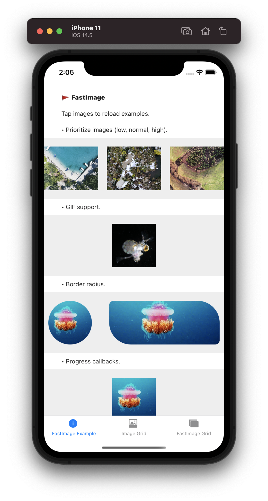

# test-react-native-fast-image-example

The server and React Native example taken from [DylanVann/react-native-fast-image](https://github.com/DylanVann/react-native-fast-image).

## Install

- in the server subfolder `yarn install`
- in the example subfolder `yarn install`
  - `cd ios`
  - add to the Podfile the fixes for XCode 12.5 from [this post](https://infinitbility.com/build-failed-after-update-xcode-12.5)
  - execute command `pod install`
  - back to the example subfolder
  - in one terminal execute `yarn start` which starts the React Native bundler at port 8081
  - in the second terminal execute `yarn run ios` which should build the iOS application and run it in the iOS emulator



You do not need to start the React Native bundler, if you execute `yarn run ios` it starts the bundler if it is not running.

Note: if you get this error below re-run `pod install` command inside the `ios` folder

```
react-native/React/CxxBridge/RCTCxxBridge.mm:330:34: error: cannot initialize a parameter of type 'NSArray<id<RCTBridgeModule>> *' with an rvalue of type 'NSArray<Class> *'
  (void)[self _initializeModules:RCTGetModuleClasses() withDispatchGroup:prepareBridge lazilyDiscovered:NO];
                                 ^~~~~~~~~~~~~~~~~~~~~
/Users/glebbahmutov/git/test-react-native-fast-image-example/ReactNativeFastImageExample/node_modules/react-native/React/CxxBridge/RCTCxxBridge.mm:770:82: note: passing argument to parameter 'modules' here
- (NSArray<RCTModuleData *> *)_initializeModules:(NSArray<id<RCTBridgeModule>> *)modules
```

## Adding Expo

Following [bahmutov/react-native-to-expo](https://github.com/bahmutov/react-native-to-expo) advice using same version of React DOM as React.

First, upgraded React to 17.x because the latest react-native-web sets peer dependency

```text
$ yarn add react@latest
info Direct dependencies
└─ react@17.0.2
$ yarn add -D react-dom@latest expo expo-cli react-native-web
info Direct dependencies
├─ expo-cli@4.7.2
├─ expo@41.0.1
├─ react-dom@17.0.2
└─ react-native-web@0.17.1
```
